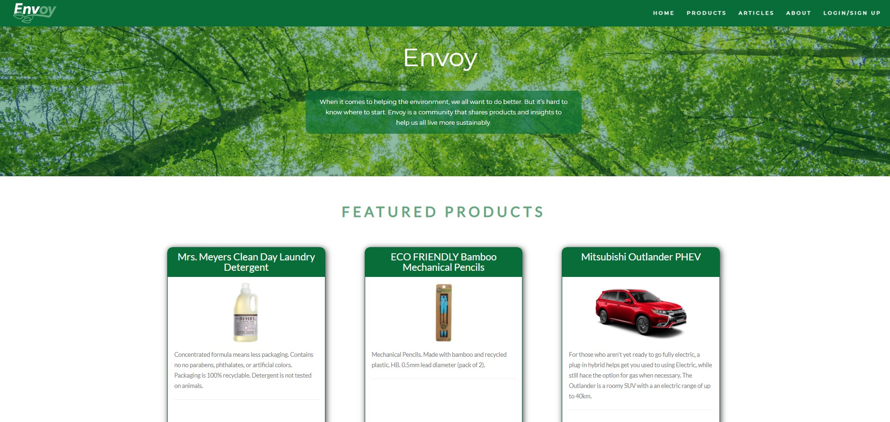

# 

A community for members to post, rate and review environmentally responsible products and share their ideas about how to live more sustainably!

## Table Of Content
* [Contributors](#contributors)
* [General Info](#general-info)
* [Technologies](#technologies)
* [Installation](#installation)
* [Usage](#usage)
* [Future Development](#future-development)
* [Screenshot](#screenshot)
* [License](#license)
* [Questions](#questions)

## Contributors
|Eric Normann|Samiul Choudhury|Benn Asabir|Nathan Chow|Shamim Imtiaz|
|:---:|:---:|:---:|:---:|:---:|
||||||
|<a href="https://github.com/e-p-n" target="_blank">Eric's Github</a>| <a href="https://github.com/samiul1988"> Samiul's Github</a>|<a href="https://github.com/BennAsabir">Benn's Github</a>|<a href="https://github.com/nchow18">Nathan's Github</a>|<a href="https://github.com/shamimimtiaz">Shamim's Github|""|


## General Info
The application follows the MVC paradigm in its architectural structure, using Handlebars.js as the templating language, Sequelize as the ORM, and the express-session npm package for authentication.
[Presentation](public/images/Envoy.pdf)

## Technologies
Project is created with 
* [MySQL](https://dev.mysql.com/downloads/)
* Javascript
* [Node.js](https://nodejs.org/en/)
* [Express](https://www.npmjs.com/package/express)
* [Sequelize](https://www.npmjs.com/package/sequelize)
* [MySQL2](https://www.npmjs.com/package/mysql2)
* [Dotenv](https://www.npmjs.com/package/dotenv)
* [Bootstrap](https://getbootstrap.com/)
* [connect-session-sequelize](https://www.npmjs.com/package/connect-session-sequelize)
* [bcrypt](https://www.npmjs.com/package/bcrypt)
* [Express-Handlebars](https://www.npmjs.com/package/express-handlebars)
* [Flickity](https://www.npmjs.com/package/flickity)
* [jQuery Bar Rating](https://www.npmjs.com/package/jquery-bar-rating)
* [typed.js](https://www.npmjs.com/package/typed.js)

## Installation
to haveTo install Envoy locally, you will need to have MySQL and Node.js installed.

To get started clone this repository using 
```terminal
git clone git@github.com:Envoy-products/Envoy-Products.git
```
Both Node.js and MySQL must be installed on your computer.

Add a .env file to the root of the app with the following details
``` 
DB_NAME='envoy_product_db' 
DB_USER='root' 
DB_PW='password'
SESS_SECRET='yoursecrettext'


Install dependencies 
```terminal
npm install
``` 
Open up MySQL shell and input 
```terminal
source db/schema.sql
```
Quit MySQL shell and install the necessary library by entering: 
```terminal
npm install
```
Input the following to insert sample data into the database
```terminal
npm run seeds
```
Enter the following to launch the server
```terminal
npm start
```
Once all that is done, navigate to - http://localhost:3001 to begin!


## Usage
This application is deployed on Heroku at https://envoy-guide.herokuapp.com/

There are three types of access:
* **Visitor access**
* **Member access**
* **Administrator access**

**Visitor access** allows one to 
* View all web content including featured/approved product and articles
* Products can be viewed by category.
* Has the option to become a member by signing up. 

**Member access** allows one to do all a visitor can, plus:
* Post articles or products (which requires approval by admin for others to view)
* Edit or delete articles or products already posted
* Edit their profile as needed
* Comment on existing articles posted on the site. 

**Administrator access** allows one to do all a member can, plus:
* Ability to set the status of an article or product posted by a member to "pending", "approved", or "featured"
* Ability to edit or delete articles or products post be a member.  

## Future Development
Upcoming features:
* Add retailers to single product view page
* Collect region information from users and filter their view of Retailers to ones that serve their region
* Allow users to add categories and retailers when they add a product
* Allow admins to delete comments/reviews from all users and to suspend users

## Screenshot


## License
  
This repository is licensed under the MIT license.

## Questions
Questions about this repository? Please contact us at [envoyproducts90@gmail.com](mailto:envoyproducts90@gmail.com). View more of our work in GitHub at [Envoy-Products](https://github.com/Envoy-products/Envoy-Products) 